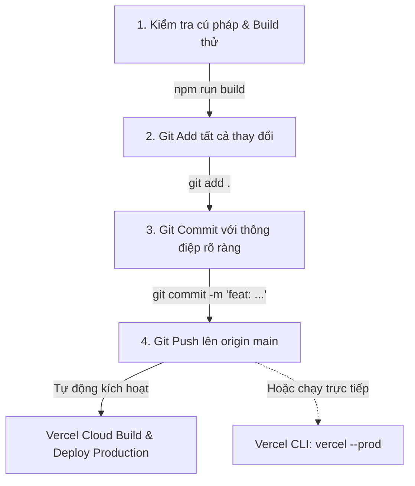
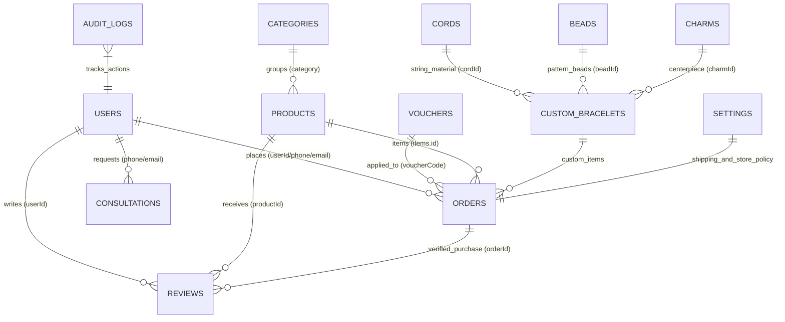

# 🤖 AGENT.MD - BẢN ĐỒ KIẾN TRÚC HỆ THỐNG & QUY TRÌNH AUTO COMMIT / DEPLOY

> **Dành cho AI (Antigravity, Gemini, ChatGPT, Claude, Cursor) & Developer**:  
> Tài liệu này mô tả toàn bộ cấu trúc kiến trúc, thư mục, thành phần giao diện, luồng dữ liệu Backend/Frontend, quy tắc sinh mã chính xác và quy trình tự động Commit & Deploy lên Vercel cho dự án **KhánhVyMade (Vòng Tay Thủ Công Mỹ Nghệ)**.

---

## 📌 1. TỔNG QUAN DỰ ÁN & CÔNG NGHỆ

- **Tên dự án**: `khanhvymade-vongtay`
- **Mục tiêu**: Nền tảng E-Commerce chuyên biệt cho trang sức vòng tay thủ công mỹ nghệ cao cấp, tích hợp **Xưởng tự phối vòng 3D Three.js WebGL 360° tương tác vật lý** kết hợp 2D SVG, **AR Thử Vòng Ảo Trực Tiếp Qua Camera Cổ Tay**, AI đo kích thước & phong thủy mệnh, **Thanh toán VietQR Webhook tự động kích hoạt** (kèm âm thanh chuông ngân ting-ting & pháo hoa confetti), **Kiến trúc chịu tải 10.000+ người đồng thời** với TTL Cache Layer & nén ảnh Canvas client-side, quản trị Web Admin 100% "Trang Cứng" (Zero Browser Alert/Confirm) và Desktop App cho bàn xâu vòng.
- **Môi trường & Tech Stack**:
  - **Frontend**: React 18/19, Vite 5, Three.js (WebGL 3D Orbit & Physical Shaders), Tailwind CSS v4, Lucide React, Canvas 2D/3D, Web Audio API (Synthesized Chime).
  - **Backend**: Node.js 20+ (ES Modules `type: module`), Express 5, In-Memory TTL Cache Engine (`cacheService.js`), Morgan, Cors, Dotenv.
  - **Serverless API**: `api/index.js` (Export Express app làm Vercel Serverless Function).
  - **Database**: 12 Bảng Dữ Liệu Quan Hệ Toàn Vẹn (Relational Integrity) trên Hybrid PostgreSQL (Neon DB Cloud qua `pg` pool) kết hợp fallback Local in-memory/JSON store (`neonDb.js`, `dbStore.js`, `db.json`, `seedData.js`).
  - **Desktop App**: Python 3, CustomTkinter, Pillow, Requests (`desktop_app/app.py`).
  - **CI/CD & Cloud**: GitHub Actions (`.github/workflows/deploy.yml`) + Vercel Deployment (`vercel.json`).

---

## 🗂️ 2. BẢN ĐỒ CẤU TRÚC THƯ MỤC (DIRECTORY MAP)

```text
e:\VIBANVONGTAY\
├── .github/
│   └── workflows/
│       └── deploy.yml            # CI/CD Pipeline GitHub Actions -> Kiểm tra build & Deploy Vercel
├── .vercel/
│   └── project.json              # Liên kết Vercel Project (projectId, orgId, projectName)
├── api/
│   └── index.js                  # Entry point cho Vercel Serverless Function (Forward -> backend/src/server.js)
├── backend/                      # BACKEND SERVICE (Express REST API)
│   ├── src/
│   │   ├── controllers/          # Tầng xử lý nghiệp vụ (Business Logic Controllers)
│   │   │   ├── paymentWebhookController.js # Webhook xác nhận thanh toán VietQR / Casso / SePay tự động
│   │   │   └── ...
│   │   ├── routes/               # Tầng định tuyến API (Express Router)
│   │   ├── utils/
│   │   │   └── cacheService.js   # Bộ đệm In-Memory TTL tốc độ cao (Chịu tải 10.000+ CCU, auto-GC)
│   │   ├── data/                 # Tầng lưu trữ & 12 bảng liên kết quan hệ Neon DB + Fallback
│   │   ├── middleware/           # Middleware bảo mật, log, xác thực
│   │   └── server.js             # Entry point máy chủ Express (Port 5000 / Vercel export)
│   ├── .env                      # Biến môi trường Backend (DATABASE_URL, JWT_SECRET...)
│   └── package.json
├── frontend/                     # FRONTEND SPA (React + Vite + Tailwind CSS + Three.js)
│   ├── public/                   # Tài nguyên tĩnh (Ảnh mẫu vòng tay, icon, favicon)
│   ├── src/
│   │   ├── assets/               # Tài nguyên hình ảnh, media import trực tiếp
│   │   ├── components/           # Thư viện component giao diện phân theo module
│   │   │   ├── customizer/
│   │   │   │   ├── BraceletStudio.jsx    # Xưởng phối vòng chính (hỗ trợ chuyển đổi 3D/2D)
│   │   │   │   └── Bracelet3DViewer.jsx  # Mô phỏng 3D WebGL 360°, raycaster picking, physical materials
│   │   │   ├── admin/
│   │   │   │   ├── AdminDashboard.jsx    # Dashboard quản trị 12 bảng dữ liệu
│   │   │   │   ├── ProductEditorView.jsx # Trang cứng quản lý/thêm sửa sản phẩm
│   │   │   │   ├── VoucherEditorView.jsx # Trang cứng quản lý/thêm sửa mã giảm giá
│   │   │   │   ├── CharmManagerView.jsx  # Trang cứng quản lý charm & hạt phong thủy
│   │   │   │   └── OrderManagerView.jsx  # Trang cứng quản lý & in phiếu đơn hàng
│   │   ├── utils/
│   │   │   ├── imageCompressor.js        # Nén ảnh Canvas phía client (tiết kiệm băng thông, tránh tràn tải)
│   │   │   └── soundEffects.js          # Âm thanh chuông ngân ting-ting tổng hợp qua Web Audio API
│   │   ├── context/              # Quản lý State toàn cục (CartContext: Giỏ hàng, Wishlist...)
│   │   ├── services/             # Client gọi API Backend (api.js)
│   │   ├── App.jsx               # Component trung tâm kết nối các views & modals
│   │   ├── App.css               # CSS bổ trợ
│   │   ├── index.css             # CSS chính tích hợp Tailwind v4 và Custom Typography
│   │   └── main.jsx              # Entry point React DOM
│   ├── index.html
│   ├── vite.config.js            # Cấu hình Vite & Proxy /api sang localhost:5000
│   └── package.json
├── desktop_app/                  # ỨNG DỤNG DESKTOP CHO THỢ XÂU VÒNG (CustomTkinter Python)
│   ├── app.py                    # Giao diện Dark/Light mode hiển thị đơn đặt & số hạt
│   ├── requirements.txt
│   └── README.md
├── scratch/                      # SCRIPTS BỔ TRỢ, TOOL DATA, CROP ẢNH, SEED
├── vercel.json                   # Cấu hình Vercel (Builds, Routes rewrite /api/(.*), Headers cache)
├── package.json                  # Root scripts (build, dev:backend, dev:frontend)
├── README.md                     # Tài liệu giới thiệu & chạy dự án
└── Agent.md                      # [TÀI LIỆU NÀY] Blueprint cho AI & Tự động Deploy
```

---

## 🧩 3. CÁC THÀNH PHẦN CHI TIẾT (COMPONENT DEEP-DIVE)

### 3.1. Frontend Components (`frontend/src/components/`)

| Phân Loại | Tệp Tin (`.jsx`) | Vai Trò & Chức Năng Cốt Lõi | State / Props Quan Trọng |
| :--- | :--- | :--- | :--- |
| **layout** | `Navbar.jsx` | Thanh điều hướng đầu trang, danh mục, thanh tìm kiếm, giỏ hàng badge, nút mở Customizer, AI Camera, Admin. | `onOpenCart`, `onOpenWishlist`, `onOpenCustomizer`, `onOpenAiCamera`, `onOpenAdmin`, `searchQuery` |
| | `Footer.jsx` | Chân trang phong cách Artisanal Warm Boutique, chính sách bảo hành đá tự nhiên, bảo dưỡng dây trọn đời, hotline. | Tĩnh & link điều hướng |
| | `AnnouncementBar.jsx`| Thanh thông báo ưu đãi chạy đầu trang (VD: Freeship đơn >300k, ưu đãi độc quyền theo mùa). | Tĩnh / Cấu hình từ admin |
| | `MobileBottomBar.jsx`| Thanh điều hướng cố định chân màn hình điện thoại (Trang chủ, Xưởng phối, AI Scan, Giỏ hàng, Tra cứu). | Nhận handler mở modal tương tự Navbar |
| **home** | `HeroSection.jsx` | Banner giới thiệu giá trị vòng tay thủ công, chất liệu gốm pastel, đá tự nhiên, nút CTA "Phối vòng ngay". | Callback chuyển tab / mở Customizer |
| **product** | `ProductCard.jsx` | Card hiển thị từng mẫu vòng: ảnh sắc nét, badge ngũ hành, giá bán, nút xem nhanh, nút thả tim (Wishlist). | `product`, `onSelect`, `onQuickAdd` |
| | `ProductFilter.jsx` | Bộ lọc chuyên sâu: Theo Mệnh (Kim, Mộc, Thủy, Hỏa, Thổ, Toàn bộ), phân loại hạt/dây, sắp xếp giá/bán chạy. | `selectedMenh`, `setSelectedMenh`, `sortOption`, `setSortOption` |
| | `ProductModal.jsx` | Modal chi tiết sản phẩm: chọn size cổ tay (XS-XL), đánh giá sao & nhận xét thực tế, ảnh cận cảnh, chọn mua. | `product`, `isOpen`, `onClose`, `onAddToCart` |
| | `WristSizeModal.jsx` | Modal hướng dẫn khách đo cổ tay tại nhà bằng thước dây hoặc giấy, bảng quy đổi chu vi cổ tay (cm) ra số hạt. | `isOpen`, `onClose`, `onSelectSize` |
| **customizer**| `BraceletStudio.jsx`| **Xưởng tự phối độc bản (2D/3D)**: Cho phép chuyển đổi linh hoạt giữa canvas 2D và mô phỏng không gian 3D. Tự tính tổng chi phí động, quản lý vị trí hạt/charm. | `isOpen`, `onClose`, `onAddToCart`, gọi `/api/customizer/options` và `/api/customizer/calculate` |
| | `Bracelet3DViewer.jsx`| **Mô hình 3D Three.js WebGL tương tác 360°**: Xoay lật không gian, zoom cận cảnh hạt đá, hiệu ứng ánh sáng vật lý MeshPhysicalMaterial (độ trong suốt, tán xạ ánh sáng, ánh kim loại), Raycaster click chọn hạt trực tiếp trên không gian 3 chiều. | `beads`, `charm`, `cord`, `selectedSlot`, `onSelectSlot` |
| **ai** | `AICameraModal.jsx` | **AI Scan & AR Thử Vòng**: 3 chế độ (1. Đo chu vi cổ tay bằng thẻ mẫu, 2. Quét nhận diện ảnh vòng để tìm sản phẩm tương đương, 3. **AR Thử Vòng Ảo Trực Tiếp Qua Camera Cổ Tay** với lưới căn chỉnh, đổi size 14-19cm, góc nghiêng -45° đến +45°). | `isOpen`, `onClose`, `mode`, gọi `/api/ai/measure-wrist` và `/api/ai/match-product` |
| **personalization**| `PersonalizedSection.jsx`| Tư vấn phong thủy theo ngày tháng năm sinh, âm lịch, cung hoàng đạo, gợi ý màu đá tương sinh/tương hợp. | `onSelectProduct` |
| **cart** | `CartDrawer.jsx` | Giỏ hàng trượt cạnh phải: Thanh tiến trình Freeship, danh sách sản phẩm (kèm chi tiết charm/hạt custom), nhập mã Voucher động, nút chuyển sang Thanh toán. | `isOpen`, `onClose`, `onOpenCheckout`, dùng `useCart()` |
| | `WishlistDrawer.jsx`| Danh sách các mẫu vòng khách đã thả tim lưu lại xem sau. | `isOpen`, `onClose`, dùng `useCart()` |
| **checkout** | `CheckoutModal.jsx` | Điền thông tin người nhận, chọn phương thức (COD hoặc Chuyển khoản QR), **tạo mã VietQR tự động**, **Polling Webhook thời gian thực** (khi tài khoản nhận tiền -> tự động kêu ting-ting, nổ pháo hoa confetti, chuyển trạng thái đơn sang Đã thanh toán). | `isOpen`, `onClose`, `cartItems`, `totalAmount`, gọi `/api/orders` |
| **tracking** | `OrderTrackingModal.jsx`| Khách nhập mã đơn hàng (hoặc SĐT) để tra cứu tiến độ thời gian thực: *Đã tiếp nhận -> Thợ đang xâu hạt -> Đóng gói hộp quà -> Đang giao hàng*. | `isOpen`, `onClose`, gọi `/api/orders/:id` hoặc `/api/orders/track` |
| **auth** | `AuthModal.jsx` | Đăng nhập / Đăng ký qua SĐT, Email hoặc tài khoản Quản trị viên (Admin). | `isOpen`, `onClose`, `onSuccess` |
| | `UserProfileModal.jsx`| Xem thông tin tài khoản, danh sách đơn hàng đã đặt, điểm tích lũy thành viên, địa chỉ giao hàng mặc định. | `isOpen`, `onClose`, `currentUser` |
| **admin** | `AdminDashboard.jsx`| Bảng điều khiển quản trị toàn diện: Xem biểu đồ doanh thu, quản lý 12 bảng dữ liệu liên kết quan hệ (Sản phẩm, Đơn hàng, Voucher, Đánh giá, Tư vấn, Danh mục, Khách hàng, Charms, Beads, Cords, Settings, Logs). | `isOpen`, `onClose`, gọi toàn bộ `/api/admin/*` |
| | `ProductEditorView.jsx`| **Trang cứng thêm/sửa sản phẩm**: Giao diện độc lập thay thế modal, quản lý ảnh, nén ảnh tự động, thuộc tính, mệnh, kho hàng. | `product`, `onSave`, `onCancel` |
| | `VoucherEditorView.jsx`| **Trang cứng thêm/sửa mã giảm giá**: Giao diện độc lập thay thế modal (100% không dùng alert/confirm), xem trước vé voucher trực quan. | `voucher`, `onSave`, `onCancel` |
| | `CharmManagerView.jsx` | **Trang cứng quản lý Charm & Hạt phong thủy**: Thêm/sửa linh kiện xâu vòng, upload ảnh có nén Canvas, điều chỉnh giá nhập và giá bán. | `onBack`, `onRefresh` |
| | `OrderManagerView.jsx` | **Trang cứng quản lý đơn hàng & in phiếu đóng gói**: Tìm kiếm, lọc theo trạng thái, in phiếu giao hàng chuẩn thợ thủ công. | `orders`, `onUpdateStatus` |

### 3.2. Frontend Utilities & Services

- **`frontend/src/utils/imageCompressor.js`**: Nén ảnh Canvas phía client trước khi upload. Tự động resize ảnh tối đa 1280px và nén JPEG/WebP chất lượng cao (0.82), giảm dung lượng từ 5-10MB xuống còn 100-250KB, giúp hệ thống không bị nghẽn mạng khi hàng nghìn người cùng tải ảnh lên.
- **`frontend/src/utils/soundEffects.js`**: Tạo âm thanh chuông ngân "ting-ting" báo nhận tiền bằng Web Audio API (dao động sóng sin tần số 1046.5Hz & 1318.5Hz kết hợp độ ngân vang decay), không phụ thuộc file MP3 bên ngoài, hoạt động mượt mà ngay trên thiết bị di động.
- **`frontend/src/context/CartContext.jsx`**: Quản lý giỏ hàng, Wishlist, Voucher đang áp dụng với cơ chế tự động đồng bộ `localStorage`.
- **`frontend/src/services/api.js`**: Đóng gói API Client, bổ sung kiểm tra trạng thái thanh toán tự động `checkPaymentStatus(orderId)`.

---

### 3.3. Backend Architecture & High Concurrency Engine (`backend/src/`)

```text
backend/src/
├── controllers/
│   ├── productController.js          # CRUD sản phẩm, lọc theo mệnh, phân trang (kèm In-Memory Cache 60s)
│   ├── orderController.js            # Tạo đơn, tra cứu đơn hàng, cập nhật trạng thái đơn
│   ├── customizerController.js       # Cung cấp danh mục hạt/dây/charm (kèm In-Memory Cache 180s)
│   ├── paymentWebhookController.js   # Nhận Webhook từ Casso/SePay/VietQR, tự động duyệt đơn đã thanh toán
│   ├── aiController.js               # Xử lý ảnh AI: đo kích thước tay (wrist scale), nhận diện catalog match
│   ├── adminController.js            # Thống kê doanh thu, vi mạch vi mô kho, và kiểm tra toàn vẹn quan hệ
│   ├── authController.js             # Đăng nhập, đăng ký, JWT token, xác thực admin
│   ├── voucherController.js          # Kiểm tra và áp dụng mã giảm giá (kèm In-Memory Cache 60s)
│   ├── reviewController.js           # Quản lý đánh giá sao, bình luận từ khách hàng (xác minh verified buyer)
│   ├── wishlistController.js         # Đồng bộ danh sách yêu thích
│   └── consultationController.js     # Lưu trữ & xử lý yêu cầu tư vấn phong thủy/kích cỡ
├── routes/
│   ├── productRoutes.js              # /api/products
│   ├── orderRoutes.js                # /api/orders (kèm /payment-webhook và /:id/payment-status)
│   ├── customizerRoutes.js           # /api/customizer
│   ├── aiRoutes.js                   # /api/ai
│   ├── adminRoutes.js                # /api/admin
│   ├── authRoutes.js                 # /api/auth
│   ├── voucherRoutes.js              # /api/vouchers
│   ├── reviewRoutes.js               # /api/reviews
│   ├── wishlistRoutes.js             # /api/wishlist
│   ├── consultationRoutes.js         # /api/consultations
│   └── categoryRoutes.js             # /api/categories
├── utils/
│   └── cacheService.js               # In-Memory Cache Engine với TTL, auto background sweep GC
├── data/
│   ├── neonDb.js                     # Kết nối Neon PostgreSQL Cloud (Pool connection tự phục hồi)
│   ├── dbStore.js                    # Quản lý 12 bảng liên kết quan hệ và Fallback lưu trữ
│   ├── db.json                       # Snapshot dữ liệu JSON nội bộ
│   └── seedData.js                   # Dữ liệu ban đầu (hạt, đá, charm, dây đan, sản phẩm mẫu)
└── server.js                         # Cấu hình Express app, CORS, Webhook route, Body-parser (20MB)
```

---

## 🎨 4. NGUYÊN TẮC THIẾT KẾ & CODE GENERATION CHO AI

Khi AI được yêu cầu thêm tính năng, sửa lỗi hoặc tạo mới component:

1. **Ngôn ngữ & Giọng điệu**:
   - Sử dụng tiếng Việt chuẩn phong cách Boutique thủ công ấm áp (*"Nghệ nhân"*, *"Độc bản"*, *"Xâu hạt"*, *"Đá phong thủy tự nhiên"*, *"Chỉ ngũ sắc"*, *"Bảo hành dây trọn đời"*).
2. **Hệ màu sắc (Warm Artisanal Palette)**:
   - Màu chủ đạo: Terracotta (cam đất nung `#C85A32`), Linen/Beige (`#FDFBF7`), Sage Green (`#8A9A86`), Mực than/Gỗ sẫm (`#2C2724`), Vàng đồng vintage (`#D4AF37`).
   - Font chữ: Tiêu đề dùng font thanh lịch cổ điển serif (`Cormorant Garamond`), nội dung văn bản dùng sans-serif hiện đại, nét đọc rõ ràng (`Plus Jakarta Sans`).
3. **Tính toàn vẹn của Dữ liệu**:
   - Khi sửa đổi Controller Backend, luôn giữ cơ chế Fallback an toàn (nếu Neon DB bận/ngắt kết nối, chuyển mượt sang `dbStore` để website không bao giờ bị sập hay trả lỗi 500 trắng trang).
   - Route `api/index.js` là Serverless Function trên Vercel, tuyệt đối không tạo thêm server lắng nghe cổng riêng trong thư mục `api/`.
4. **Kiểm tra cú pháp trước khi hoàn tất**:
   - Luôn kiểm tra tính tương thích ES Modules: Sử dụng cú pháp `import`/`export`, kèm đuôi file `.js` trong Backend (VD: `import app from './server.js'`).
   - Kiểm tra build Frontend: chạy `npm run build` hoặc kiểm tra cú pháp JSX để tránh lỗi thẻ đóng mở hoặc lỗi import icon từ `lucide-react`.

---

## 🚀 5. QUY TRÌNH TỰ ĐỘNG COMMIT VÀ DEPLOY VERCEL

Hệ thống hỗ trợ 2 cơ chế Deploy chính:
- **Cơ chế 1: Git Push -> Vercel Auto Deploy** (Khuyên dùng - Qua GitHub Actions hoặc Vercel GitHub App).
- **Cơ chế 2: Direct Deploy qua Vercel CLI** (Nhanh nhất - Deploy trực tiếp từ máy tính lên Cloud).

### 5.1. Quy Trình Tự Động Hóa Chuẩn (Pipeline)

Mỗi khi AI hoặc Developer hoàn thành một task, hãy tuân thủ tuần tự 4 bước sau:



---

### 5.2. Lệnh Tự Động Hóa (1-Click Command cho PowerShell trên Windows)

Chạy 1 dòng lệnh duy nhất trong terminal root `e:\VIBANVONGTAY`:

#### 👉 Cách 1: Commit & Push GitHub (Vercel tự bắt sự kiện và deploy)
```powershell
npm run build; if ($?) { git add .; git commit -m "feat/fix: cap nhat tinh nang va toi uu he thong"; git push origin main }
```

#### 👉 Cách 2: Deploy trực tiếp bằng Vercel CLI (Ngay lập tức không cần đợi GitHub CI)
```powershell
npm run build; if ($?) { vercel --prod --yes }
```

#### 👉 Cách 3: Script kết hợp toàn diện (Build -> Commit -> Push -> Deploy)
```powershell
# Chạy trong PowerShell:
npm run build
if ($LASTEXITCODE -eq 0) {
    git add .
    git commit -m "update: dong bo ma nguon va deploy phien ban moi"
    git push origin main
    vercel --prod --yes
    Write-Host "✅ ĐÃ COMMIT & DEPLOY LÊN VERCEL THÀNH CÔNG!" -ForegroundColor Green
} else {
    Write-Host "❌ BUILD THẤT BẠI - HỦY QUÁ TRÌNH DEPLOY ĐỂ TRÁNH LỖI HỆ THỐNG!" -ForegroundColor Red
}
```

---

### 5.3. Hướng Dẫn Dành Cho AI Tự Động Thực Hiện Sau Khi Sửa Code

Khi người dùng ra lệnh: *"Làm xong tự commit và deploy"* hoặc *"deploy lên vercel"*, AI phải tự động thực hiện tuần tự bằng tool `run_command`:

1. **Bước 1: Chạy build thử nghiệm**:
   ```powershell
   npm run build
   ```
   *Nếu build có lỗi: Dừng lại ngay, phân tích log lỗi, sửa code cho đến khi build thành công.*

2. **Bước 2: Kiểm tra cú pháp serverless**:
   ```powershell
   node --check api/index.js
   node --check backend/src/server.js
   ```

3. **Bước 3: Thực hiện Git Commit & Push**:
   ```powershell
   git add .
   git commit -m "feat: [ghi rõ tên tính năng hoặc lỗi vừa sửa]"
   git push origin main
   ```

4. **Bước 4: Deploy trực tiếp lên Vercel Production**:
   ```powershell
   vercel --prod --yes
   ```

---

## ⚠️ 6. NHỮNG LỖI CẦN TRÁNH TRÊN VERCEL (CHECKLIST)

1. **Phân biệt chữ hoa/chữ thường (Case Sensitivity)**:
   - Môi trường Vercel chạy trên Linux (Ubuntu). Đường dẫn import như `./components/layout/Navbar.jsx` phải chính xác 100% từng chữ hoa chữ thường.
2. **Cấu hình `vercel.json`**:
   - `builds`: build static `frontend/dist` và node serverless `api/index.js`.
   - `routes`: Phải định tuyến `/api/(.*)` về `/api/index.js` trước khi rewrite fallback `/index.html` của SPA React.
3. **Không hardcode localhost**:
   - Tất cả các lệnh gọi API ở Frontend phải sử dụng đường dẫn tương đối `/api/...` hoặc biến môi trường `import.meta.env.VITE_API_URL` để khi deploy lên domain Vercel (VD: `https://khanhvymade-vongtay.vercel.app`) tự động khớp domain.
4. **Giới hạn Serverless Function Vercel**:
   - Giới hạn payload miễn phí là 4.5MB đối với Serverless Function request, hình ảnh webcam chụp từ AI Camera cần được nén hoặc giảm kích thước độ phân giải (Canvas resize) trước khi gửi lên API `/api/ai/*`.

---

## 🔗 7. HỆ THỐNG 12 BẢNG DỮ LIỆU LIÊN KẾT QUAN HỆ (RELATIONAL INTEGRITY)

Dự án đảm bảo **không có bất kỳ bảng dữ liệu nào đứng độc lập một mình**. Cả 12 bảng đều được liên kết 2 chiều thông qua khóa ngoại (`foreign key`) và trường định danh logic:



### Chi tiết quan hệ 12 bảng:
1. **`orders` ↔ `vouchers`**: Mọi đơn hàng sử dụng mã giảm giá đều lưu `voucherCode` và `discountAmount`. Bảng Vouchers thống kê số đơn đã áp dụng và tổng tiền đã chiết khấu, có nút click mở trực tiếp danh sách đơn liên kết.
2. **`orders` ↔ `users`**: Đơn hàng liên kết với tài khoản qua `userId`, đồng thời khớp `phone` và `email`. Bảng Users trong Admin hiển thị cột "Đơn Đã Đặt" cùng tổng chi tiêu và link xem danh sách đơn hàng.
3. **`products` ↔ `categories`**: Sản phẩm được phân loại theo danh mục chuẩn (VD: `vong-menh-kim`, `vong-menh-hoa`, `vong-doi-tinh-nhan`). Admin lọc theo danh mục tự động kiểm tra sự tồn tại trong bảng Categories.
4. **`reviews` ↔ `products` & `orders`**: Đánh giá chỉ được đánh dấu "Đã mua hàng (Verified Buyer)" nếu người đánh giá có đơn hàng thành công chứa sản phẩm đó.
5. **`consultations` ↔ `users` & `products`**: Phiếu tư vấn phong thủy liên kết với số điện thoại khách hàng, gợi ý trực tiếp các sản phẩm trong bảng Products phù hợp mệnh.
6. **`beads` & `charms` & `cords` ↔ `customizer` & `orders`**: Danh mục linh kiện xâu vòng được dùng trong xưởng phối 2D/3D (`BraceletStudio.jsx`), khi khách đặt vòng tự phối, ID và tên linh kiện được lưu trực tiếp vào chi tiết đơn hàng trong `orders.customDesign`.
7. **`audit_logs` & `settings`**: Ghi nhận vết hành vi quản trị viên và cấu hình ngưỡng freeship toàn hệ thống.

Hàm `getDbTelemetry()` tại `backend/src/data/dbStore.js` kiểm tra và đo lường tính toàn vẹn quan hệ thời gian thực (`relationalIntegrity`).

---

## 🏛️ 8. CHUẨN MỰC GIAO DIỆN "TRANG CỨNG" & ZERO BROWSER NOTICE

Theo quy định nghiêm ngặt của dự án:
- **Tuyệt đối không sử dụng hàm native `alert()` hoặc `confirm()`**: Các cửa sổ thông báo mặc định của trình duyệt làm giảm trải nghiệm boutique cao cấp và gây gián đoạn luồng người dùng.
- **100% "Trang Cứng" (Standalone Full Page Workspaces)**:
  - Khi thêm/sửa sản phẩm: Chuyển sang `ProductEditorView.jsx` (không dùng modal chật hẹp).
  - Khi thêm/sửa voucher: Chuyển sang `VoucherEditorView.jsx` với card xem trước trực quan.
  - Khi quản lý charm/hạt: Chuyển sang `CharmManagerView.jsx`.
  - Khi xem chi tiết & in phiếu đơn: Chuyển sang `OrderManagerView.jsx`.
- **Thông báo Toast & Banner Nội Bộ**:
  - Mọi phản hồi người dùng (thêm giỏ hàng, sao chép mã, lưu thành công, cảnh báo form) được hiển thị qua thông báo Toast nhẹ nhàng mượt mà hoặc inline banner tự tắt sau 3 giây.
- **Xác nhận xóa (Inline Confirmation)**:
  - Thao tác xóa nhạy cảm (xóa sản phẩm, xóa mã voucher, đổi quyền user) hiển thị hộp thoại xác nhận nội tuyến (inline card xác nhận "Hủy" / "Chắc chắn xóa") nằm ngay trên giao diện trang cứng.
