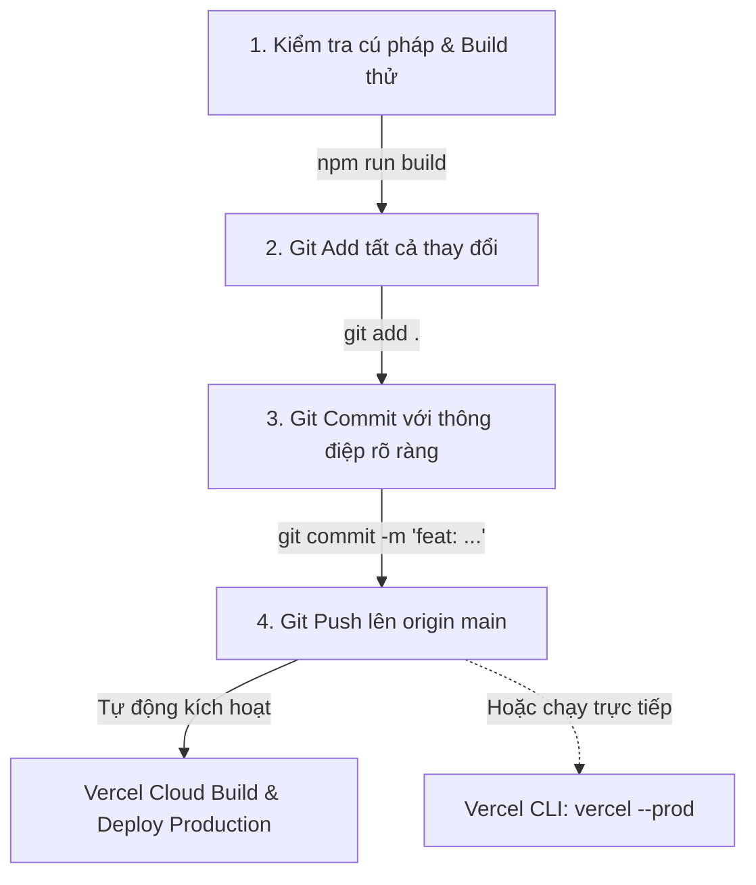

# 🤖 AGENT.MD - BẢN ĐỒ KIẾN TRÚC HỆ THỐNG & QUY TRÌNH AUTO COMMIT / DEPLOY

> **Dành cho AI (Antigravity, Gemini, ChatGPT, Claude, Cursor) & Developer**:  
> Tài liệu này mô tả toàn bộ cấu trúc kiến trúc, thư mục, thành phần giao diện, luồng dữ liệu Backend/Frontend, quy tắc sinh mã chính xác và quy trình tự động Commit & Deploy lên Vercel cho dự án **KhánhVyMade (Vòng Tay Thủ Công Mỹ Nghệ)**.

---

## 📌 1. TỔNG QUAN DỰ ÁN & CÔNG NGHỆ

- **Tên dự án**: `khanhvymade-vongtay`
- **Mục tiêu**: Nền tảng E-Commerce chuyên biệt cho trang sức vòng tay thủ công mỹ nghệ cao cấp, tích hợp xưởng tự phối vòng 2D thời gian thực (Bracelet Studio), AI quét kích thước cổ tay & nhận diện gợi ý vòng hợp phong thủy/mệnh, thanh toán VietQR tự động, quản trị Web Admin và Desktop App cho bàn xâu vòng.
- **Môi trường & Tech Stack**:
  - **Frontend**: React 18, Vite 5, Tailwind CSS v4, Lucide React, Google Fonts (*Cormorant Garamond* & *Plus Jakarta Sans*).
  - **Backend**: Node.js 20+ (ES Modules `type: module`), Express 5, Morgan, Cors, Dotenv.
  - **Serverless API**: `api/index.js` (Export Express app làm Vercel Serverless Function).
  - **Database**: Hybrid PostgreSQL (Neon DB Cloud qua `pg` pool) kết hợp fallback Local in-memory/JSON store (`neonDb.js`, `dbStore.js`, `db.json`, `seedData.js`).
  - **Desktop App**: Python 3, CustomTkinter, Pillow, Requests (`desktop_app/app.py`).
  - **CI/CD & Cloud**: GitHub Actions (`.github/workflows/deploy.yml`) + Vercel Deployment (`vercel.json`).

---

## 🗂️ 2. BẢN ĐỒ CẤU TRÚC THƯ MỤC (DIRECTORY MAP)

```text
e:\VIBANVONGTAY\
├── .github/
│   └── workflows/
│       └── deploy.yml            # CI/CD Pipeline GitHub Actions -> Kiểm tra build & Deploy Vercel
├── .vercel/
│   └── project.json              # Liên kết Vercel Project (projectId, orgId, projectName)
├── api/
│   └── index.js                  # Entry point cho Vercel Serverless Function (Forward -> backend/src/server.js)
├── backend/                      # BACKEND SERVICE (Express REST API)
│   ├── src/
│   │   ├── controllers/          # Tầng xử lý nghiệp vụ (Business Logic Controllers)
│   │   ├── routes/               # Tầng định tuyến API (Express Router)
│   │   ├── data/                 # Tầng lưu trữ & kết nối Neon PostgreSQL + Fallback Data
│   │   ├── middleware/           # Middleware bảo mật, log, xác thực
│   │   └── server.js             # Entry point máy chủ Express (Port 5000 / Vercel export)
│   ├── .env                      # Biến môi trường Backend (DATABASE_URL, JWT_SECRET...)
│   └── package.json
├── frontend/                     # FRONTEND SPA (React 18 + Vite + Tailwind CSS)
│   ├── public/                   # Tài nguyên tĩnh (Ảnh mẫu vòng tay, icon, favicon)
│   ├── src/
│   │   ├── assets/               # Tài nguyên hình ảnh, media import trực tiếp
│   │   ├── components/           # Thư viện component giao diện phân theo module
│   │   ├── context/              # Quản lý State toàn cục (CartContext: Giỏ hàng, Wishlist...)
│   │   ├── services/             # Client gọi API Backend (api.js)
│   │   ├── App.jsx               # Component trung tâm kết nối các views & modals
│   │   ├── App.css               # CSS bổ trợ
│   │   ├── index.css             # CSS chính tích hợp Tailwind v4 và Custom Typography
│   │   └── main.jsx              # Entry point React DOM
│   ├── index.html
│   ├── vite.config.js            # Cấu hình Vite & Proxy /api sang localhost:5000
│   └── package.json
├── desktop_app/                  # ỨNG DỤNG DESKTOP CHO THỢ XÂU VÒNG (CustomTkinter Python)
│   ├── app.py                    # Giao diện Dark/Light mode hiển thị đơn đặt & số hạt
│   ├── requirements.txt
│   └── README.md
├── scratch/                      # SCRIPTS BỔ TRỢ, TOOL DATA, CROP ẢNH, SEED
│   ├── update_seed_data.py
│   ├── sync_seed_to_db_json.py
│   └── test_crop.py
├── vercel.json                   # Cấu hình Vercel (Builds, Routes rewrite /api/(.*), Headers cache)
├── package.json                  # Root scripts (build, dev:backend, dev:frontend)
├── README.md                     # Tài liệu giới thiệu & chạy dự án
└── Agent.md                      # [TÀI LIỆU NÀY] Blueprint cho AI & Tự động Deploy
```

---

## 🧩 3. CÁC THÀNH PHẦN CHI TIẾT (COMPONENT DEEP-DIVE)

### 3.1. Frontend Components (`frontend/src/components/`)

| Phân Loại | Tệp Tin (`.jsx`) | Vai Trò & Chức Năng Cốt Lõi | State / Props Quan Trọng |
| :--- | :--- | :--- | :--- |
| **layout** | `Navbar.jsx` | Thanh điều hướng đầu trang, danh mục, thanh tìm kiếm, giỏ hàng badge, nút mở Customizer, AI Camera, Admin. | `onOpenCart`, `onOpenWishlist`, `onOpenCustomizer`, `onOpenAiCamera`, `onOpenAdmin`, `searchQuery` |
| | `Footer.jsx` | Chân trang phong cách Artisanal Warm Boutique, chính sách bảo hành đá tự nhiên, bảo dưỡng dây trọn đời, hotline. | Tĩnh & link điều hướng |
| | `AnnouncementBar.jsx`| Thanh thông báo ưu đãi chạy đầu trang (VD: Freeship đơn >300k, mã `MAYMAN` giảm 10%). | Tĩnh / Cấu hình từ admin |
| | `MobileBottomBar.jsx`| Thanh điều hướng cố định chân màn hình điện thoại (Trang chủ, Xưởng phối, AI Scan, Giỏ hàng, Tra cứu). | Nhận handler mở modal tương tự Navbar |
| **home** | `HeroSection.jsx` | Banner giới thiệu giá trị vòng tay thủ công, chất liệu gốm pastel, đá tự nhiên, nút CTA "Phối vòng ngay". | Callback chuyển tab / mở Customizer |
| **product** | `ProductCard.jsx` | Card hiển thị từng mẫu vòng: ảnh sắc nét, badge ngũ hành, giá bán, nút xem nhanh, nút thả tim (Wishlist). | `product`, `onSelect`, `onQuickAdd` |
| | `ProductFilter.jsx` | Bộ lọc chuyên sâu: Theo Mệnh (Kim, Mộc, Thủy, Hỏa, Thổ, Toàn bộ), phân loại hạt/dây, sắp xếp giá/bán chạy. | `selectedMenh`, `setSelectedMenh`, `sortOption`, `setSortOption` |
| | `ProductModal.jsx` | Modal chi tiết sản phẩm: chọn size cổ tay (XS-XL), đánh giá sao & nhận xét thực tế, ảnh cận cảnh, chọn mua. | `product`, `isOpen`, `onClose`, `onAddToCart` |
| | `WristSizeModal.jsx` | Modal hướng dẫn khách đo cổ tay tại nhà bằng thước dây hoặc giấy, bảng quy đổi chu vi cổ tay (cm) ra số hạt. | `isOpen`, `onClose`, `onSelectSize` |
| **customizer**| `BraceletStudio.jsx`| **Xưởng tự phối độc bản 2D**: Canvas mô phỏng vòng tròn thời gian thực. Khách chọn loại dây (sáp/chỉ/macrame), từng hạt đá, charm gốm, charm bạc. Tự tính tổng chi phí động. | `isOpen`, `onClose`, `onAddToCart`, gọi `/api/customizer/options` và `/api/customizer/calculate` |
| **ai** | `AICameraModal.jsx` | **AI Scan Đa Năng**: Chụp/Upload ảnh cổ tay để tính chu vi (dùng thẻ ATM làm mốc tỉ lệ chuẩn), hoặc chụp ảnh mẫu vòng để catalog-match tìm sản phẩm tương đương; tư vấn phong thủy AI. | `isOpen`, `onClose`, `mode` ('wrist' \| 'catalog_match'), gọi `/api/ai/measure-wrist` và `/api/ai/match-product` |
| **personalization**| `PersonalizedSection.jsx`| Tư vấn phong thủy theo ngày tháng năm sinh, âm lịch, cung hoàng đạo, gợi ý màu đá tương sinh/tương hợp. | `onSelectProduct` |
| **cart** | `CartDrawer.jsx` | Giỏ hàng trượt cạnh phải: Thanh tiến trình Freeship, danh sách sản phẩm (kèm chi tiết charm/hạt custom), nhập mã Voucher, nút chuyển sang Thanh toán. | `isOpen`, `onClose`, `onOpenCheckout`, dùng `useCart()` |
| | `WishlistDrawer.jsx`| Danh sách các mẫu vòng khách đã thả tim lưu lại xem sau. | `isOpen`, `onClose`, dùng `useCart()` |
| **checkout** | `CheckoutModal.jsx` | Điền thông tin người nhận, chọn phương thức (COD hoặc Chuyển khoản QR), **tạo mã VietQR tự động** (kèm số tiền và mã đơn chuẩn xác). | `isOpen`, `onClose`, `cartItems`, `totalAmount`, gọi `/api/orders` |
| **tracking** | `OrderTrackingModal.jsx`| Khách nhập mã đơn hàng (hoặc SĐT) để tra cứu tiến độ thời gian thực: *Đã tiếp nhận -> Thợ đang xâu hạt -> Đóng gói hộp quà -> Đang giao hàng*. | `isOpen`, `onClose`, gọi `/api/orders/:id` hoặc `/api/orders/track` |
| **auth** | `AuthModal.jsx` | Đăng nhập / Đăng ký qua SĐT, Email hoặc tài khoản Quản trị viên (Admin). | `isOpen`, `onClose`, `onSuccess` |
| | `UserProfileModal.jsx`| Xem thông tin tài khoản, danh sách đơn hàng đã đặt, điểm tích lũy thành viên, địa chỉ giao hàng mặc định. | `isOpen`, `onClose`, `currentUser` |
| **admin** | `AdminDashboard.jsx`| Bảng điều khiển quản trị toàn diện: Xem biểu đồ doanh thu, quản lý 10 bảng dữ liệu (Sản phẩm, Đơn hàng, Voucher, Đánh giá, Tư vấn, Danh mục, Khách hàng). Cập nhật trạng thái đơn xâu vòng. | `isOpen`, `onClose`, gọi toàn bộ `/api/admin/*` |

### 3.2. Frontend State Management & API Service

- **`frontend/src/context/CartContext.jsx`**:
  - Quản lý State giỏ hàng (`cart`), Wishlist (`wishlist`), Voucher đang áp dụng (`appliedVoucher`).
  - Tự động đồng bộ với `localStorage` để không mất dữ liệu khi F5.
  - Các hàm tiện ích: `addToCart(item, customOptions)`, `removeFromCart(id)`, `updateQuantity(id, qty)`, `applyVoucher(code)`, `toggleWishlist(product)`.
- **`frontend/src/services/api.js`**:
  - Gói toàn bộ hàm gọi REST API: `getProducts`, `getProductById`, `getCustomizerOptions`, `calculateCustomPrice`, `createOrder`, `trackOrder`, `verifyVoucher`, `adminLogin`, `aiScanWrist`...
  - Endpoint chuẩn: `/api/*` (Khi chạy local được Vite proxy sang `http://localhost:5000`, khi deploy lên Vercel được rewrite trực tiếp sang Serverless Function `api/index.js`).

---

### 3.3. Backend Architecture (`backend/src/`)

```text
backend/src/
├── controllers/
│   ├── productController.js      # CRUD sản phẩm, lọc theo mệnh, phân trang, danh mục
│   ├── orderController.js        # Tạo đơn, tra cứu đơn hàng, cập nhật trạng thái đơn
│   ├── customizerController.js   # Cung cấp danh mục hạt/dây/charm và tính giá vòng tự phối
│   ├── aiController.js           # Xử lý ảnh AI: đo kích thước tay (wrist scale), nhận diện catalog match
│   ├── adminController.js        # Thống kê doanh thu, tổng quan kho và đơn hàng cho Admin
│   ├── authController.js         # Đăng nhập, đăng ký, JWT token, xác thực admin
│   ├── voucherController.js      # Kiểm tra và áp dụng mã giảm giá
│   ├── reviewController.js       # Quản lý đánh giá sao, bình luận từ khách hàng
│   ├── wishlistController.js     # Đồng bộ danh sách yêu thích
│   └── consultationController.js # Lưu trữ & xử lý yêu cầu tư vấn phong thủy/kích cỡ
├── routes/
│   ├── productRoutes.js          # /api/products
│   ├── orderRoutes.js            # /api/orders
│   ├── customizerRoutes.js       # /api/customizer
│   ├── aiRoutes.js               # /api/ai
│   ├── adminRoutes.js            # /api/admin
│   ├── authRoutes.js             # /api/auth
│   ├── voucherRoutes.js          # /api/vouchers
│   ├── reviewRoutes.js           # /api/reviews
│   ├── wishlistRoutes.js         # /api/wishlist
│   ├── consultationRoutes.js     # /api/consultations
│   └── categoryRoutes.js         # /api/categories
├── data/
│   ├── neonDb.js                 # Kết nối Neon PostgreSQL Cloud (Hỗ trợ tự tạo bảng nếu chưa có)
│   ├── dbStore.js                # Lớp tương thích dữ liệu: tự động fallback giữa Neon DB & local db.json
│   ├── db.json                   # Snapshot dữ liệu JSON nội bộ
│   └── seedData.js               # Dữ liệu ban đầu (hạt, đá, charm, dây đan, sản phẩm mẫu)
└── server.js                     # Cấu hình Express app, CORS, Body-parser (20MB limit cho ảnh webcam)
```

---

## 🎨 4. NGUYÊN TẮC THIẾT KẾ & CODE GENERATION CHO AI

Khi AI được yêu cầu thêm tính năng, sửa lỗi hoặc tạo mới component:

1. **Ngôn ngữ & Giọng điệu**:
   - Sử dụng tiếng Việt chuẩn phong cách Boutique thủ công ấm áp (*"Nghệ nhân"*, *"Độc bản"*, *"Xâu hạt"*, *"Đá phong thủy tự nhiên"*, *"Chỉ ngũ sắc"*, *"Bảo hành dây trọn đời"*).
2. **Hệ màu sắc (Warm Artisanal Palette)**:
   - Màu chủ đạo: Terracotta (cam đất nung `#C85A32`), Linen/Beige (`#FDFBF7`), Sage Green (`#8A9A86`), Mực than/Gỗ sẫm (`#2C2724`), Vàng đồng vintage (`#D4AF37`).
   - Font chữ: Tiêu đề dùng font thanh lịch cổ điển serif (`Cormorant Garamond`), nội dung văn bản dùng sans-serif hiện đại, nét đọc rõ ràng (`Plus Jakarta Sans`).
3. **Tính toàn vẹn của Dữ liệu**:
   - Khi sửa đổi Controller Backend, luôn giữ cơ chế Fallback an toàn (nếu Neon DB bận/ngắt kết nối, chuyển mượt sang `dbStore` để website không bao giờ bị sập hay trả lỗi 500 trắng trang).
   - Route `api/index.js` là Serverless Function trên Vercel, tuyệt đối không tạo thêm server lắng nghe cổng riêng trong thư mục `api/`.
4. **Kiểm tra cú pháp trước khi hoàn tất**:
   - Luôn kiểm tra tính tương thích ES Modules: Sử dụng cú pháp `import`/`export`, kèm đuôi file `.js` trong Backend (VD: `import app from './server.js'`).
   - Kiểm tra build Frontend: chạy `npm run build` hoặc kiểm tra cú pháp JSX để tránh lỗi thẻ đóng mở hoặc lỗi import icon từ `lucide-react`.

---

## 🚀 5. QUY TRÌNH TỰ ĐỘNG COMMIT VÀ DEPLOY VERCEL

Hệ thống hỗ trợ 2 cơ chế Deploy chính:
- **Cơ chế 1: Git Push -> Vercel Auto Deploy** (Khuyên dùng - Qua GitHub Actions hoặc Vercel GitHub App).
- **Cơ chế 2: Direct Deploy qua Vercel CLI** (Nhanh nhất - Deploy trực tiếp từ máy tính lên Cloud).

### 5.1. Quy Trình Tự Động Hóa Chuẩn (Pipeline)

Mỗi khi AI hoặc Developer hoàn thành một task, hãy tuân thủ tuần tự 4 bước sau:



---

### 5.2. Lệnh Tự Động Hóa (1-Click Command cho PowerShell trên Windows)

Chạy 1 dòng lệnh duy nhất trong terminal root `e:\VIBANVONGTAY`:

#### 👉 Cách 1: Commit & Push GitHub (Vercel tự bắt sự kiện và deploy)
```powershell
npm run build; if ($?) { git add .; git commit -m "feat/fix: cap nhat tinh nang va toi uu he thong"; git push origin main }
```

#### 👉 Cách 2: Deploy trực tiếp bằng Vercel CLI (Ngay lập tức không cần đợi GitHub CI)
```powershell
npm run build; if ($?) { vercel --prod --yes }
```

#### 👉 Cách 3: Script kết hợp toàn diện (Build -> Commit -> Push -> Deploy)
```powershell
# Chạy trong PowerShell:
npm run build
if ($LASTEXITCODE -eq 0) {
    git add .
    git commit -m "update: dong bo ma nguon va deploy phien ban moi"
    git push origin main
    vercel --prod --yes
    Write-Host "✅ ĐÃ COMMIT & DEPLOY LÊN VERCEL THÀNH CÔNG!" -ForegroundColor Green
} else {
    Write-Host "❌ BUILD THẤT BẠI - HỦY QUÁ TRÌNH DEPLOY ĐỂ TRÁNH LỖI HỆ THỐNG!" -ForegroundColor Red
}
```

---

### 5.3. Hướng Dẫn Dành Cho AI Tự Động Thực Hiện Sau Khi Sửa Code

Khi người dùng ra lệnh: *"Làm xong tự commit và deploy"* hoặc *"deploy lên vercel"*, AI phải tự động thực hiện tuần tự bằng tool `run_command`:

1. **Bước 1: Chạy build thử nghiệm**:
   ```powershell
   npm run build
   ```
   *Nếu build có lỗi: Dừng lại ngay, phân tích log lỗi, sửa code cho đến khi build thành công.*

2. **Bước 2: Kiểm tra cú pháp serverless**:
   ```powershell
   node --check api/index.js
   node --check backend/src/server.js
   ```

3. **Bước 3: Thực hiện Git Commit & Push**:
   ```powershell
   git add .
   git commit -m "feat: [ghi rõ tên tính năng hoặc lỗi vừa sửa]"
   git push origin main
   ```

4. **Bước 4: Deploy trực tiếp lên Vercel Production**:
   ```powershell
   vercel --prod --yes
   ```

---

## ⚠️ 6. NHỮNG LỖI CẦN TRÁNH TRÊN VERCEL (CHECKLIST)

1. **Phân biệt chữ hoa/chữ thường (Case Sensitivity)**:
   - Môi trường Vercel chạy trên Linux (Ubuntu). Đường dẫn import như `./components/layout/Navbar.jsx` phải chính xác 100% từng chữ hoa chữ thường.
2. **Cấu hình `vercel.json`**:
   - `builds`: build static `frontend/dist` và node serverless `api/index.js`.
   - `routes`: Phải định tuyến `/api/(.*)` về `/api/index.js` trước khi rewrite fallback `/index.html` của SPA React.
3. **Không hardcode localhost**:
   - Tất cả các lệnh gọi API ở Frontend phải sử dụng đường dẫn tương đối `/api/...` hoặc biến môi trường `import.meta.env.VITE_API_URL` để khi deploy lên domain Vercel (VD: `https://khanhvymade-vongtay.vercel.app`) tự động khớp domain.
4. **Giới hạn Serverless Function Vercel**:
   - Giới hạn payload miễn phí là 4.5MB đối với Serverless Function request, hình ảnh webcam chụp từ AI Camera cần được nén hoặc giảm kích thước độ phân giải (Canvas resize) trước khi gửi lên API `/api/ai/*`.
